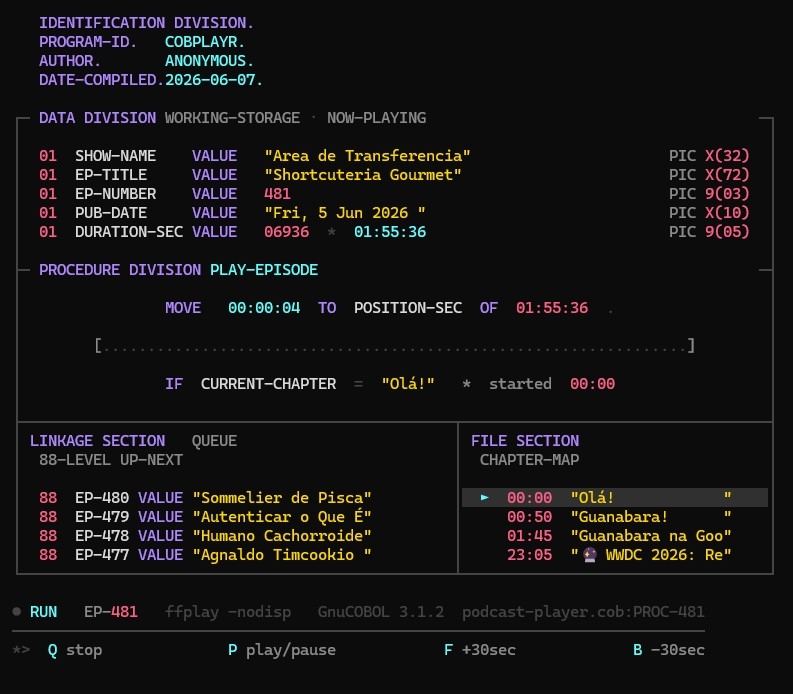

# COBOL Podcast Player

A terminal podcast player written in **GnuCOBOL** — because why not. It fetches a
real RSS feed, plays episodes through `ffplay`, extracts chapter markers with
`ffprobe`, and renders a colourful TUI styled like a COBOL source listing
(`DATA DIVISION`, `PROCEDURE DIVISION`, `88-LEVEL` queue, and a `FILE SECTION`
chapter map).



The whole player is a single ~1100-line free-format COBOL program
(`podcast-player.cob`).

---

## Inspiration

This project was inspired by **[Área de Transferência (ADT)](https://gigahertz.fm/podcasts/adt/)**,
a Brazilian weekly technology podcast — *"um podcast semanal sobre tecnologia,
feito por 4 podcasters que já respiram o assunto diariamente"* — hosted by
Marcus Mendes, Guilherme Rambo, Gustavo Faria, and Arthur Givigir, with new
episodes every Friday covering Apple, AI, and the broader tech industry.

The spark came from **episode 478, "Humano Cachorroide"**, in which Rambo
jokingly asked whether any listener was tuning into the show using COBOL. That
offhand question was too good to leave unanswered — so this player exists to make
the joke real: listen to ADT (and any other podcast) straight from a COBOL
terminal program. It ships pre-configured with the ADT feed as its default show.

---

## Features

- **Live RSS feed** fetched with `curl` and parsed line-by-line.
- **Audio playback** via `ffplay` with play / pause / stop controls.
- **Chapter map** extracted from the audio with `ffprobe`, auto-scrolling to
  keep the currently playing chapter visible.
- **Episode browser** with paging.
- **256-colour TUI** with box-drawing, a live progress bar, and a highlighted
  "now playing" chapter — all drawn with raw ANSI escape sequences.
- **UTF-8 aware** layout: accented episode/chapter titles are measured by
  display width, so the box borders stay aligned and characters are never
  sliced.
- **Startup terminal-size gate**: warns and exits if the window is too small to
  render correctly.

---

## Requirements

These must be available in your `PATH`:

| Tool | Purpose | When needed |
|------|---------|-------------|
| `cobc` (GnuCOBOL 3.x) | Compile the source | Build time |
| `curl` | Fetch the RSS feed | Runtime |
| `ffplay` (FFmpeg) | Audio playback | Runtime |
| `ffprobe` (FFmpeg) | Chapter extraction | Runtime |

A terminal at least **90 columns × 37 rows** with ANSI 256-colour support.

---

## Platform support

| Platform | Status | Notes |
|----------|--------|-------|
| **Linux** | ✅ Full | Primary target |
| **macOS** | ✅ Full | Uses the Unix code path |
| **Windows (via WSL)** | ✅ Full — **recommended** | Runs as Linux |
| **Windows (native)** | ⚠️ Limited | Builds and renders, but interactive controls are not implemented |

> **On Windows, use WSL for the best experience.** Native Windows compiles and
> plays audio and renders the UI, but the keypress controls (Q / P) and
> pause/resume are not wired up in the Windows code path, and you need an
> ANSI-capable terminal such as Windows Terminal (classic `cmd.exe` will not
> render the colours). For full functionality, run it inside
> [WSL](https://learn.microsoft.com/windows/wsl/).

### Installing dependencies

**Debian / Ubuntu (incl. WSL):**
```bash
sudo apt update
sudo apt install gnucobol curl ffmpeg
```

**macOS (Homebrew):**
```bash
brew install gnucobol curl ffmpeg
```

---

## Build

```bash
cobc -free -x podcast-player.cob -o podcast-player
```

The `-free` flag is **mandatory** — the source is FREE format (not fixed
80-column).

A `Makefile` is also provided:

```bash
make
```

---

## Run

```bash
./podcast-player
```

### Using the launcher script

`execute.sh` is a convenience wrapper that builds and runs at a known-good
terminal size (it uses `tmux`):

```bash
./execute.sh            # build, then run interactively
./execute.sh -b         # build only
./execute.sh -c         # build, then capture the now-playing screen (text)
./execute.sh -c -e 3    # capture after selecting episode 3
./execute.sh -c --raw   # capture WITH ANSI colour codes
./execute.sh -h         # help
```

> `execute.sh` requires `tmux`. It is a bash script — on Windows run it from WSL.

---

## Controls

**Podcast browser (home screen)**

| Key | Action |
|-----|--------|
| `1`–`N` + Enter | Open that show's episodes |
| `A` | Add a show — prompts for an RSS URL (validated) |
| `D` | Delete a show — enter the number, then press `D` again to confirm |
| `Q` | Quit |

**Episode browser**

| Key | Action |
|-----|--------|
| `1`–`N` + Enter | Play that episode |
| `P` | Previous page |
| `N` | Next page |
| `S` | Back to the show list |

**Now playing**

| Key | Action |
|-----|--------|
| `P` | Play / pause (toggle) |
| `F` | Forward 30 seconds |
| `B` | Back 30 seconds |
| `Q` | Stop playback (back to browser) |

---

## Podcast shows

The podcast list lives in **`shows.dat`** (one `name|url` per line), which ships
with the repo pre-populated with the default show **Área de Transferência
(ADT)**:

```
https://gigahertz.fm/podcasts/adt/feed.rss
```

Add or delete shows from the home screen (`A` / `D`); changes are saved back to
`shows.dat` and persist between runs. Added shows take their display name from
the feed's channel `<title>`. If `shows.dat` is missing it is recreated with the
ADT default.

If a feed can't be fetched, the player falls back to 6 hardcoded mock episodes;
if chapter extraction fails, it falls back to mock chapters.

---

## Architecture notes

- **Single file** (`podcast-player.cob`) — intentionally not split.
- **RSS feed**: `curl` → `feed.rss` → parsed line-by-line with `UNSTRING` /
  `STRING`.
- **Chapters**: `ffprobe` → `chapters.json` → parsed line-by-line.
- **OS detection** at startup branches Windows vs Unix shell commands
  (`sleep`/`timeout`, `pkill`/`taskkill`, keypress capture).
- **ANSI** colours and cursor positioning are defined as exact-length
  working-storage constants so `DISPLAY` emits no stray padding that would
  misalign the TUI.

---

## License

Released under the [MIT License](LICENSE) — provided "as is", without warranty
of any kind.
